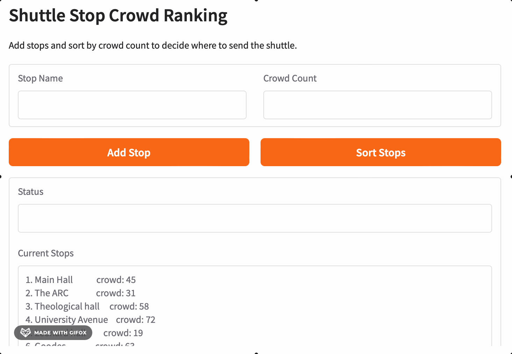

# Shuttle-Sorting

## Chosen problem
The chosen problem is the shuttle crowd ranking, which hekps coordinates the decision of where to send extra shuttles. Considering the crowd at each of them, the problem is in ranking the stops from the most to least crowded.

## Chosen algorithm
The chosen algorithm is Merge Sort. This problem is adapted to it because it is adapted for any size of lists of integers, compare to quicksort which can get to a higher complexity and isn't worth it in the context of a shorter list of crowd_count. It is also good since merge sort is stable so the changing ranking can keep the order of equal crowd_count the same as the previous ones.

## Demo

## Problem Breakdown & Computational Thinking
- Decomposition: Merge sorts algorithms can be separated in spliting the list, in this context list of stop, in half. Then, each half is sorted by splitting them continuously until each element is individual and comparing the elements to put the higher crowd_count first. Then, the two halves are merged by comparing each element and putting them in the final ranked list.
- Pattern recognition: The main pattern is continuously splitting the sublist, first in the two main list and then repeatedly to compare the items. Each individual comparison is looking for the larger crowd_count.
- Abstraction choices: The user of the algrotithm doesn't need to see the whole recursive process of the merge sort profoundly. The temporary sublist also aren't relevant to the decision making. What needs to be shown is some narration to explain the results and the changing sorted list. 
- Algorithm-design flow: The input is a list of dictionaries that indicate the name of the stop and the crowd_count. The process to get there is the merge sort, and the main steps are shown on the GUI. The output is every step on the interface and finally the sorted list of the stops names in term of crowd_count.

## Steps to Run and requirements.txt
Requirements.txt -> gradio
Steps to run:
    1. Install the dependencies, through requirements.txt which installs gradio
    2. Run the app on a Python platform (coded on Jupyter Notebook)
    3. Open the notebook and run with "Restart and run all"
    
## Testings
- The first testing was only the original list of stops, which is included in the original code to make sure the app is never empty. The sorting was successful which proved that the merge sort works:

The other main action, addind a stop, also works as shown in the demo video.

- The second was make sure that the code was handling the absence of input. A missing stop name was correctly handled with an error message:

However, the absence of a crowd count wasn't handled and raised errors in the code itself:

Another lign was added to the validate_input function to raise an appropriate error message:

- Finally, I checked the edge case of crowd_count having an input, but not in a integer type. The test was successful since the algorithm didn't add the stop to the list and printed an appropriate error message:

## Hugging Face Link
[Live App](https://huggingface.co/spaces/Evelyne06/Shuttle-Sorting)

## Author & AI Acknowledgment
- Author : Evelyne Gosselin
- Class : CISC121
- AI Use : Claude was used to give a few ideas for the code, explain how to use the GUI, summarize all the files needed and their function as well as make sure I wasn't missing any key edge case.
- CISC121 class lecture PowerPoints used
